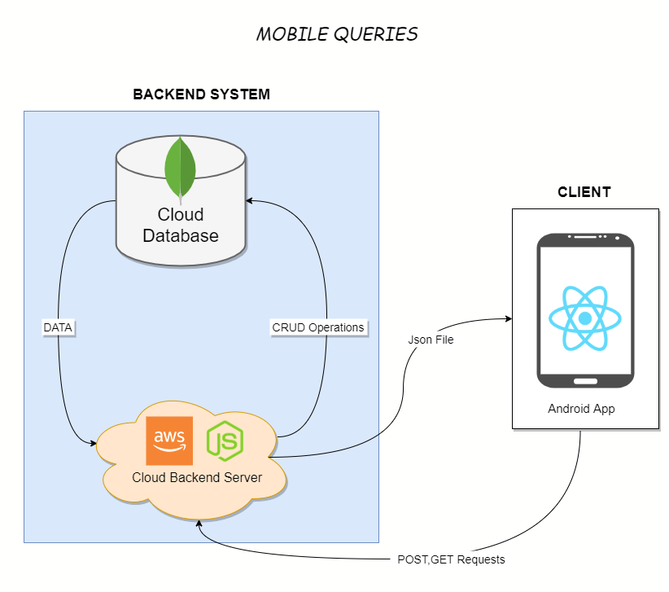

# Taxi-Tracking 

## Dependencies 
- A mongo db server 
- A Map box access token, you can find there : https://www.mapbox.com/

## Instillation
- execute npm i in mobile and server folders 
- cd mobile/android .gradlew clean\
- change mapbox access token in /mobile/functions/Api.js:2
- change mongodb MongoDb variable in  /server/app.js:12 
- change exporting server access url for react native app in /mobile/metrics:8
- insert trip datas from "yellow tripdata 2020-12.csv" file.
- insert zones datas from "taxi+ zone lookup.csv" file.
- You should change database name and name of collections.

## Execute Mobile App 
- cd mobile && react-native run-android

## Launch Server 
- execute this command : npm start in server folder.

## Özetçe 
Bu proje kapsaminda bulut bilişim ve map api kullanarak android platformunda bir uygulama geliştirmemiz beklenmektedir. Taksi gezinge (trajectory) verileri kullanılarak android platformunda farklı sorguların yapılabildiği bir uygulama geliştirmemiz amaçlanmaktadır. Biz de bulut bilişim olarak verilerimizi veri tabanında saklamak için mongodb veri tabanını seçtik. Server side kodumuzu da bizim için daha uygun bir platform olan heroku’ya deploy ettik. Bu projede bulut bilişim teknolojilerini kullanarak nasıl mobil bir uygulamayı geliştireceğimizi görmüş olduk.

## Abstract
Within the scope of this project, you are expected to develop an application on the android platform using cloud computing and google map api. We aim to develop an application where different queries can be made on the android platform using the data of taxi Gezinge (trajectory). As cloud computing, we chose the mongodb database to store our data in the database. We also deployed our server side code to heroku, which is a more suitable platform for us. In this project, we saw how we can develop a mobile application using cloud computing technologies.

## System Design 

## Data Set
https://www1.nyc.gov/site/tlc/about/tlc-trip-record-data.page

## Developers 
Berkay Efe ÖZCAN / Cumali TOPRAK

